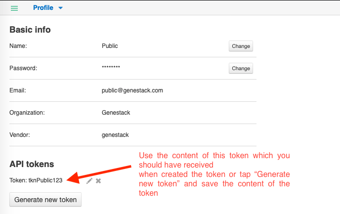

## How to set up the Genestack python client

This article explains how to set up the Genestack python client with a user and token, which can then used by other scripts.

DISCLAIMER: The processes and scripts are intended as a temporary solution until the functionality is provided in a production-ready manner. As such, they are provided as is.

## Requirements

* Python 2.7.* or Python 3
* pip

## Instructions

1. Start a console/terminal and install the genestack python client

    ```pip install genestack_client --upgrade ```

2. Obtain a token for the Public user in Genestack by logging in to ODM as the Public user and clicking on the profile link under the Public username:

   

   You will be emailed a link to your token – if using the Public account, you may need to visit the mailcatcher to obtain this link.

3. Set up your account with the Genestack client from a console with -H and provide an ODM host url in the <ODM>
   ```genestack-user-setup -H https://<ODM>/frontend```

4. Then select authentication by token (1) and input the content of the token you received in step 2:
   ``` 
   1) by token
   2) by email and password
   Select authentication: 1
   Host: https://domain_name/frontend
   Please specify Genestack API token for "my_test_user":
   ```
5. Type ‘quit' to exit the user-setup.